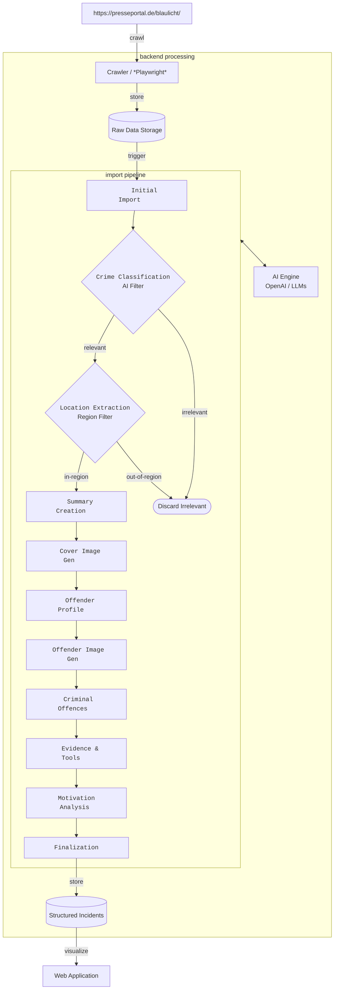

# truegotham

truegotham is a web application that reads the current crimes from the police press releases, analyzes them using AI and displays them on a dashboard. 

https://truegotham.thecodemonkey.de/

## Table of Contents

* [Motivation](#motivation)
* [How it works](#how-it-works)
  * [Data Processing Flow](#data-processing-flow)
  * [Crawler](#crawler)
  * [Import Pipeline](#import-pipeline)
* [Frontend](#frontend)
* [Project Structure](#project-structure)
* [TechStack](#techstack)


## Motivation

As a fan of true crime and "Tatort", I wanted to combine interest with practice and deepen my AI skills through a real-world project. This project serves as a playground for me to experiment with approaches like advanced prompt engineering, image generation, and agentic AI in a practical setting. It allows me to explore new models and test various GenAI methods using a real-world scenario. Ultimately, it’s a straightforward way for me to stay up-to-date technically while building something I'm personally interested in.

## How it works

truegotham reads the current crimes from the [police press releases](https://www.presseportal.de/blaulicht/nr/4971), analyzes them using AI and displays them on a dashboard. Due to the enormity of data and the associated costs, only press releases from the Dortmund region are used at the moment.

### Data Processing Flow




### Crawler

The crawler is a Service that uses Playwright to crawl the police press releases from https://presseportal.de/blaulicht/ and stores the raw data in a database.

### Import Pipeline

The pipeline is a series of steps that process the data and store it in a database. The pipeline is implemented as a series of steps that are executed in a specific order. The steps are:

1. Initial Import
2. Crime Classification
3. Location Extraction
4. Summary Creation
5. Cover Image Generation
6. Offender Profile
7. Offender Image Generation
8. Criminal Offences
9. Evidence & Tools
10. Motivation Analysis
11. Finalization


## Frontend Stack

I consciously chose a **Vanilla JS/HTML/CSS** stack for this project. This approach is extremely lightweight and minimizes abstraction layers compared to heavy frameworks like Angular or the complexity of TypeScript. 

Beyond the simplicity of manual coding, this setup is particularly optimized for **AI Coding Assistants and Agents** (like GitHub Copilot or Antigravity). Without the overhead of complex framework, npm, yarn, nx, lifecycles, build steps, or deep abstractions, AI agents can generate bug-free code much faster and handle the codebase more effectively.

Additionally, this architecture eliminates the need for a separate frontend project or complex build pipeline. The frontend is directly embedded in the Spring Boot `static` folder, allowing for a **unified deployment** of both backend and frontend as a single artifact. This drastically simplifies the deployment setup and CI/CD process. For projects of this scale or specialized tools, this "back-to-basics" approach provides a highly productive and performant environment.

> **Note:** While I still prefer the Vanilla stack, I am increasingly moving towards augmenting it with standard **WebComponents** and **Lit**. `truegotham` has not yet been refactored, but I may do so in the future. This combination has personally emerged as the "ultimate" frontend stack for simple projects, especially when combined with AI coding agents.


## Project Structure

```text
truegotham/
├── src/main/kotlin/.../truegotham/
│   ├── import/          # Core pipeline logic and ImportFlow steps
│   ├── service/         # AI connectors, Crawler (Playwright), and Geocoding
│   ├── model/           # Entity definitions and structured AI result models
│   ├── controller/      # REST endpoints for the dashboard
│   ├── repository/      # Database access (H2/Filesystem persistence)
│   ├── config/          # Bean configurations and security settings
│   └── utils/           # Shared helper classes and extensions
├── src/main/resources/
│   ├── static/          # Vanilla JS Frontend (embedded in Spring Boot)
│   │   ├── components/  # Modular dashboard UI components
│   │   └── index.html   # Main entry point for the Web Application
│   ├── prompts/         # Specialized text templates for LLM reasoning
│   ├── data/            # Static data lookups (e.g., district geojson or mappings)
│   └── application.yml  # System configuration and API settings
├── data/                # H2 Database location on dev machine
├── Dockerfile           # Environment setup for deployment (Docker/K8s)
└── build.gradle         # Dependency management (Kotlin/Spring Boot)
```

## TechStack

*   **Backend:** Kotlin, Spring
*   **Frontend:** Vanilla HTML/CSS/JS
*   **AI:** OpenAI, gpt-4.x/5.x, gpt-image-1
*   **MAP:** Leaflet, OpenStreetMap
*   **Database:** H2/filesystem
*   **Deployment:** Docker, Kubernetes
*   **CI/CD:** GitHub Actions, GitHub Container Registry
*   **IDE:** IntelliJ IDEA/GitHub Copilot and Antigravity/Gemini


